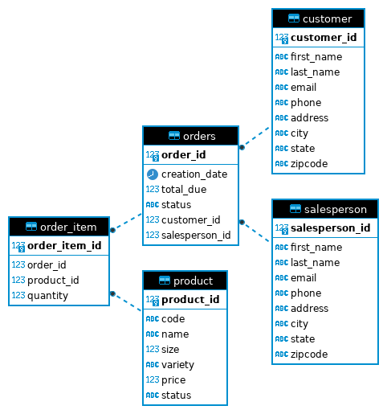

# Introduction
The JDBC Application is a product designed to assist junior developers with establishing connections and execution of queries from the JDBC application to a RDBMS.
The technologies used for the development of this project are Java and the JDBC API for handling of connections between the application and database, a
PostgreSQL database to persist the data, and Docker for dependencies management and deployment of the PostgreSQL instance. Git and GitHub were used for version control and 
Apache Maven was used for building of the project and dependency management of java libraries. Deployment of the application was done on a Google Cloud Platform virtual machine.

# Implementation
## ER Diagram

## Design Patterns
### DAO Pattern
Data Access Object Pattern is an abstraction of data persistence and is a lower level concept that is closely connected to the underlying storage which will likely be table-focused.
Implementation of the DAO pattern is done with a domain class to handle the objects and an object DAO class handles the implementation of the queries.

### Repository Pattern
The Repository Pattern is a higher level concept with a closer relation to domain objects and business logic requirements. 
The Repository Pattern is a domain-driven design which makes the data structures of the application easier to understand for all team members. 
Compared to the DAO Pattern, Repository Pattern hides the complexity of collating data and preparing a complex domain object. The pattern may 
also use one or multiple DAO classes to access necessary data.

# Test
- Creation of the database was done using DBeaver and executing DDL SQL commands to create the tables based on sample data
- The JDBC Application was tested by manually testing CRUD functions from DAO classes and comparing against results given from DBeaver running the same queries
