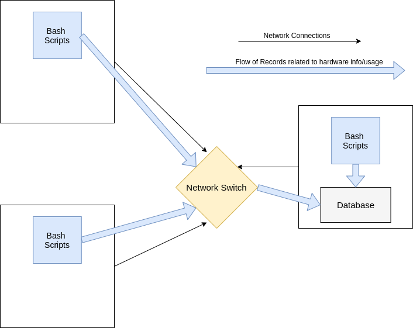

# Introduction
The Linux Clustering Monitoring Agent is a product designed to assist Administration Teams
with recording hardware specifications of hardware nodes/servers and tracking of resource usage in real-time.
The development of this product would provide Adminstration Teams better understanding of company resource usage
and if servers are required to be added or removed. The technologies used to develop this product are Bash scripts
to handle the recording of hardware specifications and resource usage, a PostgreSQL database to persist the
information recorded, Docker to manage dependencies and deployment of the PostgreSQL Database Software.
Git and Github were used for version control and Intellij IDEA for IDE purposes.

# Quick Start

#### psql_docker.sh
- Used to create docker container running psql database software and to run it for first time
```
scripts/psql_docker.sh create [db_username] [db_password]
```
- To start/stop the container after initial creation of container
```
scripts/psql_docker.sh start | stop
```

#### ddl.sql
- Used for the creation of tables related to hardware specification and resource usage records
```
psql -h localhost -U postgres -d host_agent -f sql/ddl.sql
```

#### host_info.sh
- Used for gathering system hardware specifications and storing in host_info table, only required to run once per system
```
scripts/host_info.sh [psql_host] [psql_port] [db_name] [psql_user] [psql_password]
```

#### host_usage.sh
- Used for gathering logs of system resource utilization and storing in host_usage table, will require setting up in crontab afterwards
```
scripts/host_usage.sh [psql_host] [psql_port] [db_name] [psql_user] [psql_password]
```

# Implementation
Implementation of the project began with understanding the necessary technologies/languages required to implement the monitoring agent. 
Design and 


## Architecture


## Scripts
`psql_docker.sh` was created so that there is a means of creating a database instance that can be interacted with to store records.

`host_info.sh` was created using shell scripting language to provide streamline instructions necessary
for gathering system hardware specifications.

`host_usage.sh` was created using shell scripting language to provide streamline instructions necessary
for gathering system hardware utilization.

`crontab` is used so that the script ``host_usage.sh`` runs automatically based on how often the user needs 
details of resource utilization to be recorded.

## Database Modeling
### host_info

| id                                             | hostname                   | cpu_number       | cpu_architecture   | cpu_model          | cpu_mhz           | l2_cache        | timestamp            | total_mem       |
|------------------------------------------------|----------------------------|------------------|--------------------|--------------------|-------------------|-----------------|----------------------|-----------------|
| SERIAL (Auto Generated, NOT NULL, PRIMARY KEY) | VARCHAR (NOT NULL, UNIQUE) | INT2  (NOT NULL) | VARCHAR (NOT NULL) | VARCHAR (NOT NULL) | FLOAT8 (NOT NULL) | INT4 (NOT NULL) | TIMESTAMP (NOT NULL) | INT4 (NOT NULL) |

### host_usage

| timestamp | host_id                                          | memory_free     | cpu_idle        | cpu_kernel      | disk_io         | disk_available  | 
|-----------|--------------------------------------------------|-----------------|-----------------|-----------------|-----------------|-----------------|
| NOT NULL  | SERIAL (NOT NULL, Primary key from Host_info id) | INT4 (NOT NULL) | INT2 (NOT NULL) | INT2 (NOT NULL) | INT4 (NOT NULL) | INT4 (NOT NULL) | 

# Testing


# Deployment
all scripts were designed and testing to be used with Bash
Docker needs to be installed

# Improvements
- Provide better parameter flexibility for the shell scripts
- Possibility to produce a cohesive scripting solution to initialize set up
  (run a script to run psql_docker.sh then ddl.sql script to produce tables, host_info.sh to obtain hardware specs, etc.)
- Leave additional comments/context of the implementation of scripts

